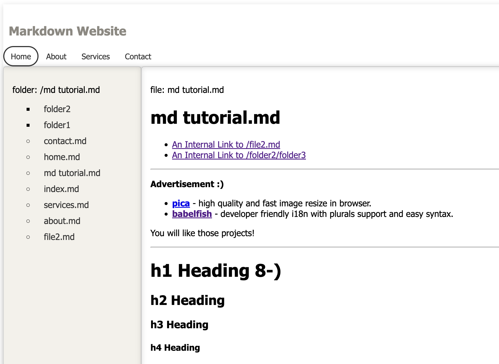

# What is it? 
It's a simple website pointing to a local folder containing sub-folders & markdown files. 

# Installation 
1. UV python package mgmt installtion: eg use 'brew install uv' on mac

# How to run it? 
Still trying to figure out how to use uv python package mgr to create cli app. Meanwhile,  
1. check out code and cd into the folder 
2. run cmd: 'uv venv' (to create virtual env)
3. run cmd: 'source .venv/bin/activate' (to activate virtual env)
4. run cmd: 'uv sync' (to get virtual env installed with needed libs)
5. run cmd: 'uv run --env-file=.env uvicorn main:app' (to start the web app)
6. open browser and input url http://0.0.0.0:8000/

# What's next? 
1. you can remove all sub folders and md files except md files mentioned in templates/header file. 
2. or you can point the content folder in .env file to folder other than content
3. or you can customize files under templates folder, eg. look and feel, change welcome message to something else

# Misc
1. UV installtion on mac: brew install uv
2. Init project: uv init py-site-w-md-files
3. Launch vscode: code py-site-w-md-files
4. Create .venv: uv venv --python 3.12
5. Activate venv: source .venv/bin/activate
6. Add fastapi: uv add "fastapi[standard]"
8. Run: 
    a. "uv run fastapi run main.py"
    b. or "uv run uvicorn main:app --reload"
    c. or "uv run --env-file=.env uvicorn main:app --reload"

